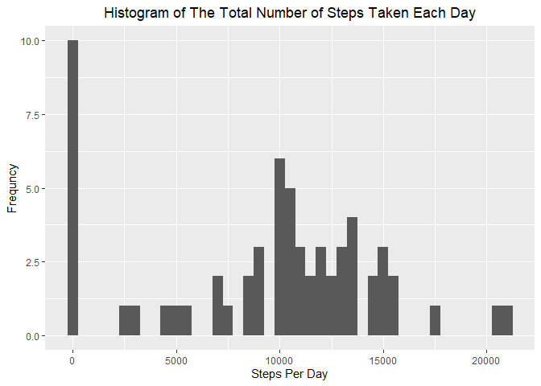
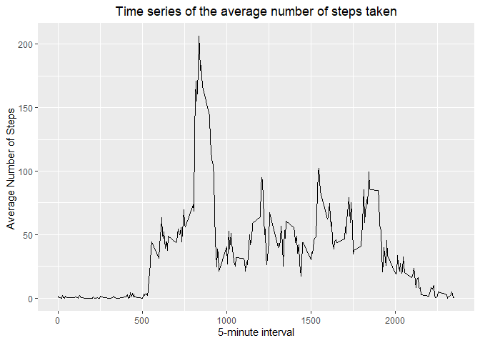
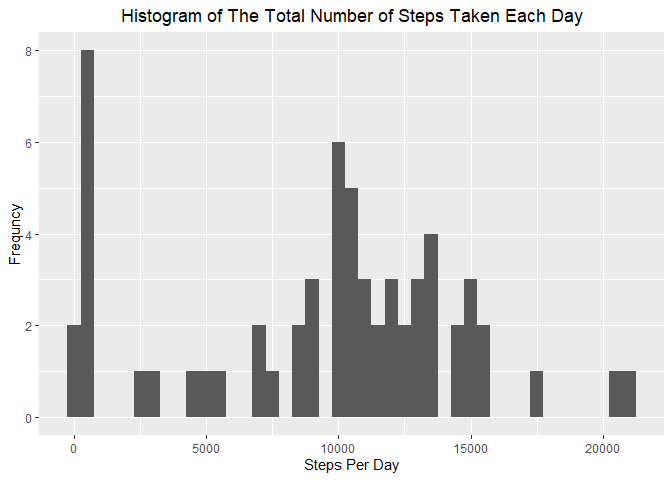
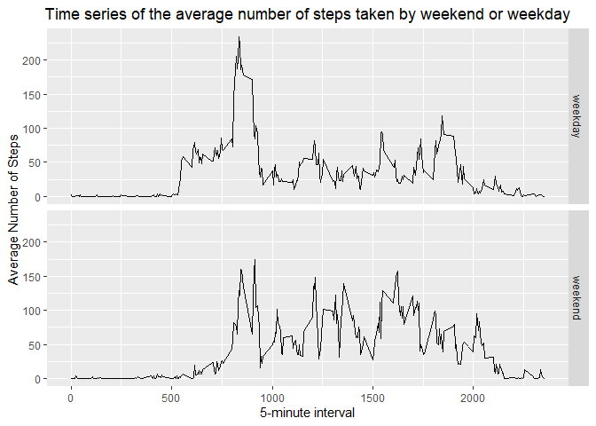

## Loading and preprocessing the data
### 1. Setting Working Directory

```r
setwd("~/RepData_PeerAssessment1")
```
### 2. Load the .CSV file using *readr* package

```r
d <- readr::read_csv("activity.zip")
head(d)
```

```
## # A tibble: 6 x 3
##   steps date       interval
##   <dbl> <date>        <dbl>
## 1    NA 2012-10-01        0
## 2    NA 2012-10-01        5
## 3    NA 2012-10-01       10
## 4    NA 2012-10-01       15
## 5    NA 2012-10-01       20
## 6    NA 2012-10-01       25
```

## What is mean total number of steps taken per day?
### 1. Calculate the total number of steps taken per day

```r
library(magrittr)
library(dplyr)
s <- d %>% group_by(date) %>% summarise(steps_per_day = sum(steps,na.rm=TRUE)) 
head(s)
```

```
## # A tibble: 6 x 2
##   date       steps_per_day
##   <date>             <dbl>
## 1 2012-10-01             0
## 2 2012-10-02           126
## 3 2012-10-03         11352
## 4 2012-10-04         12116
## 5 2012-10-05         13294
## 6 2012-10-06         15420
```
### 2. Make a histogram of the total number of steps taken each day

```r
library(ggplot2)
s %>% ggplot(aes(x = steps_per_day)) + geom_histogram(binwidth = 500) +
  xlab("Steps Per Day") + ylab("Frequncy") +
  ggtitle("Histogram of The Total Number of Steps Taken Each Day") +
  theme(plot.title = element_text(hjust = 0.5))
```

<!-- -->
### 3. Calculate and report the mean and median of the total number of steps taken per day

```r
m1 <- mean(s$steps_per_day)
m2 <- median(s$steps_per_day)
```
The mean of the total number of steps taken per day is 9354.2295082 and the median mean of the total number of steps taken per day is 1.0395\times 10^{4}

## What is the average daily activity pattern?
### The 5-minute interval and the average number of steps taken, averaged across all days

```r
a <- d %>% group_by(interval) %>% summarise(meansteps = mean(steps, na.rm = TRUE)) 
head(a)
```

```
## # A tibble: 6 x 2
##   interval meansteps
##      <dbl>     <dbl>
## 1        0    1.72  
## 2        5    0.340 
## 3       10    0.132 
## 4       15    0.151 
## 5       20    0.0755
## 6       25    2.09
```
### 1. Time series of the 5-minute interval and the average number of steps taken, averaged across all days 

```r
a %>% ggplot(aes(x = interval , y = meansteps)) + geom_line()+
  xlab("5-minute interval") + ylab("Average Number of Steps ") +
  ggtitle("Time series of the average number of steps taken") +
  theme(plot.title = element_text(hjust = 0.5))
```

<!-- -->
### 2. The 5-minute interval contains the maximum number of steps 

```r
a1 <- a %>% filter(meansteps == max(meansteps)) %>% slice(1)
a1 <- unname(unlist(a1[1,1]))
```
The 5-minute interval contains the maximum number of steps is at 835
## Imputing missing values
### 1. Calculate and report the total number of missing values in the dataset 

```r
missing <- d %>% filter(is.na(steps)) %>% nrow
```
The number of missing values in the dataset is 2304

### 2. Filling in all of the missing values in the dataset. 

```r
library(tidyr)
replace_na(d$steps,1) %>% head
```

```
## [1] 1 1 1 1 1 1
```
### 3. Create a new dataset that is equal to the original dataset but with the missing data filled in

```r
I <- d %>%  mutate(steps = replace_na(steps,1))
head(I)
```

```
## # A tibble: 6 x 3
##   steps date       interval
##   <dbl> <date>        <dbl>
## 1     1 2012-10-01        0
## 2     1 2012-10-01        5
## 3     1 2012-10-01       10
## 4     1 2012-10-01       15
## 5     1 2012-10-01       20
## 6     1 2012-10-01       25
```
### 4. Make a histogram of the total number of steps taken each day

```r
Is <- I %>% group_by(date) %>% summarise(steps_per_day = sum(steps)) 
Is %>%   ggplot(aes(x = steps_per_day)) + geom_histogram(binwidth = 500) +
  xlab("Steps Per Day") + ylab("Frequncy") +
  ggtitle("Histogram of The Total Number of Steps Taken Each Day") +
  theme(plot.title = element_text(hjust = 0.5))
```

<!-- -->
#### Calculate and report the mean and median total number of steps taken per day

```r
m3 <- mean(Is$steps_per_day)
m4 <- median(Is$steps_per_day)
```
The mean of the total number of steps taken per day is 9392 and the median mean of the total number of steps taken per day is 1.0395\times 10^{4}
#### What is the impact of imputing missing data on the estimates of the total daily number of steps?
As it is shown in the new histogram the values of ones increased signfically than zeros compared to the first histogram

## Are there differences in activity patterns between weekdays and weekends?
### 1. Create a new factor variable in the dataset with two levels – “weekday” and “weekend” 

```r
f <- d %>% mutate(WD =weekdays(date)) %>% 
  mutate(weekend = ifelse(WD %in% c("Saturday","Sunday"),"weekend" , "weekday"))
head(f)
```

```
## # A tibble: 6 x 5
##   steps date       interval WD     weekend
##   <dbl> <date>        <dbl> <chr>  <chr>  
## 1    NA 2012-10-01        0 Monday weekday
## 2    NA 2012-10-01        5 Monday weekday
## 3    NA 2012-10-01       10 Monday weekday
## 4    NA 2012-10-01       15 Monday weekday
## 5    NA 2012-10-01       20 Monday weekday
## 6    NA 2012-10-01       25 Monday weekday
```

### 2. Make a panel plot of a time series of the 5-minute interval and the average number of steps taken, averaged across all weekday days or weekend days 

```r
f %>% group_by(weekend,interval) %>% summarise(meansteps = mean(steps,na.rm=TRUE)) %>%
  ggplot(aes(interval , meansteps)) + geom_line() + facet_grid(weekend ~ .) +
  xlab("5-minute interval") + ylab("Average Number of Steps ") +
  ggtitle("Time series of the average number of steps taken by weekend or weekday") +
  theme(plot.title = element_text(hjust = 0.5))
```

<!-- -->
